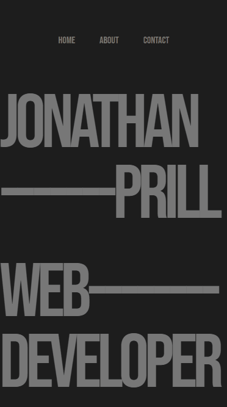

<h1 align="center">Jonathan Prill Portfolio</h1>

    

    
    
     
    
    

    
    
    
    
    
    

    <a href="https://jonathanprill.github.io/personal-portfolio/">Link To Deployed Website</a>

    

